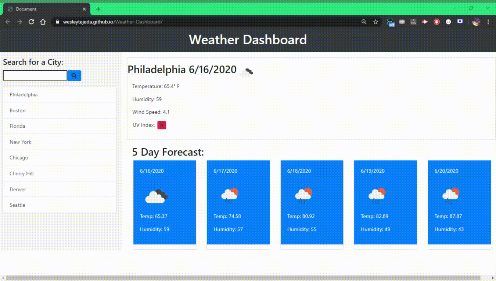

# Weather-Dashboard
By: ```Wesley Tejeda```

Deployed link: [https://wesleytejeda.github.io/Weather-Dashboard]

My GitHub : [https://github.com/wesleytejeda/WeatherDashboard]

## General
In this repository I created a website that uses OpenWeather's API to display current weather conditions and a 5 day forecast for any city.

## Demo



## Usage
When you first land on the page it will show a list of cities on the left column with the first city's weather already loaded. You can click on either the other cities on the list or search your own city using the search bar. Doing this adds the city to the list, creating a history. When you come back to the site, the last city search will display.

## My Approach in Detail
To access the weather information I used OpenWeather's 5 day and 7 day API's. Since the 5 day API only has 3-hour forecasts rather than a daily I had to nest a call to extract the city's lattitude and longitude and use them to access the 7 day API, thus giving us our daily weather reports. I later extracted the 5 day forecast and current temperature to display on my page.

After displaying the weather info, I saved the city's inputted into local storage where the history can be retrieved to display the user's last city searched when they return and show they're history on the list group.

You'll notice when a user clicks the list of cities, the list gets sorted again. I used 2 different sorting functions displayed below.
```
//This function is used for clicking the list-group
function cycleCityChanged(id){
    //We take an input of id for this function to go to it to cycle the cities downward
    var temp = $("#"+id).html();
    for(var i=(id); i > 0; i--){
        $("#"+i).html($("#"+(i-1)).html())
    }
    //Once we move all the cities down a item, we display the city to the first item signifying current city
    $("#1").html(temp);
}
//This function is used for the search bar
function searchBarCycleList(){
    //We cycle through our list items from bottom to top and move cities downward
    for(var i=8; i > 0; i--){
        $("#"+i).html($("#"+(i-1)).html());
    }
    //After, we overwrite the first item with the current city
    $("#1").html(city);
}
```
This helps keep our history accurate in terms of avoiding duplicates and assuring that when using the search bar the cities get cycled downward.

Finally, I used certain breakpoints in the HTML page to add responsiveness to the web page. There is a mobile compatible mode, although I decided to remove the history list group as it makes the page look less cluttered. All views above mobile have history implemented.

## Resources Used
7day OpenWeather API
(https://openweathermap.org/api/one-call-api)

5day OpenWeather API
(https://openweathermap.org/forecast5)
